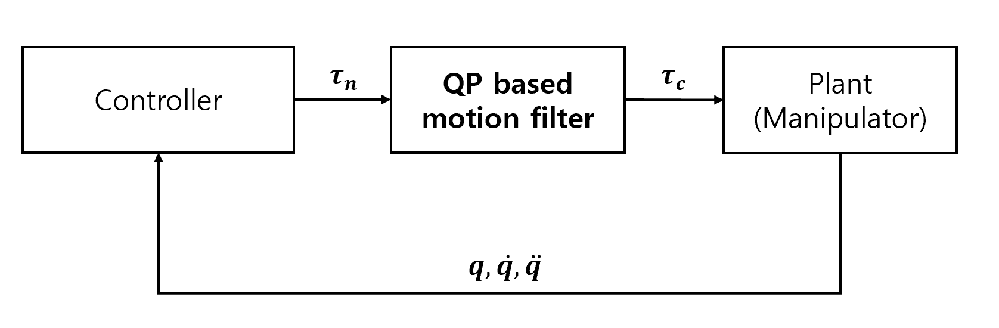

# QP based motion filter
Torque filter for manipulator for safety control.

## Foundational Theory
### Foundational ResearchPaper
Lee, Donghyeon, et al. "Maximal Manipulation Framework Using Quadratic Programming for a Teleoperated Robotic System with Articulated Bodies." *2022 International Conference on Robotics and Automation (ICRA)*, IEEE, 2022.

### Torque Filtering
  

When the controller controls the manipulator, it serves to filter the output of the controller so that it does not exceed the constraint of the manipulator.
The joint constraints are expressed as follows.  

$$q_{min}<  q< q_{max}
$$  

$$\dot q_{min}< \dot q<\dot q_{max}
$$  

$$\ddot q_{min}< \ddot q<\ddot q_{max}
$$    


We solve with QP the process of finding $\tau_{n}$ closest to $\tau_{c}$ among $\tau$ satisfying the above constructs.

  
$$\underset{\tau_{c}, \rho}{\text{min}}(\| \tau_{n}-\tau_{c}\| ^{2}) + \rho^{T}W \rho
$$


  
In the above formula, $\rho$ and $W$ were introduced to apply some slack in CLF application for wrist angle limitation.

### Quadratic Programming
By organizing the robot dynamics equation below, we can organize the acceleration $\ddot q$ as an equation for the torque $\tau$.

$$M \ddot q + C \dot q + g = \tau
$$  

$$\ddot q = M^{-1}(\tau -C \dot q -g)
$$  

Therefore, we can change linear constraints about $\ddot q$ to linear constraints about $\tau$.  

$$\ddot q_{min}< M^{-1}(\tau -C \dot q -g) < \ddot q_{max}
$$

$$= \ddot q_{min} + M^{-1}(C\dot q +g)< M^{-1} \tau < \ddot q_{max} + M^{-1}(C\dot q +g)
$$  

$$=lb< M^{-1} \tau < ub
$$

So, we can make linear constraints of torque with Inverse of Mass Matrix M: $M^{-1}$, lower bound $lb$, and upper bound $ub$.


## Dependencies

This project utilizes the following package:

- **qpOASES**:  A library for efficiently solving quadratic programming problems in real-time.

*The source code for the package is included in the repository.*

## Cmake Build
1. Create a Build Directory:
   ```bash
   mkdir build
   cd build  
2. Build:
    ```bash
   cmake ..
   cmake --build . 
3. Run the Executable:
    ```bash
   cd Debug
   cd ./QP-based-motion-filter


## Source Codes
### include/QP_based_motion_filter.hpp
Have to change enum parameters in header file.  

The *degree of freedom* and *the number of constraints* must be changed according to the situation.
```c
	enum
	{
		 DOF = 6, // degree of freedom of the manipulator
		 CONSTRAINTS_NUM = 4,  // constraints set num
		 k_slack = 6, // slack variable num
	};
```
### src/main.cpp
Very simple example of how to use qpfilter.


